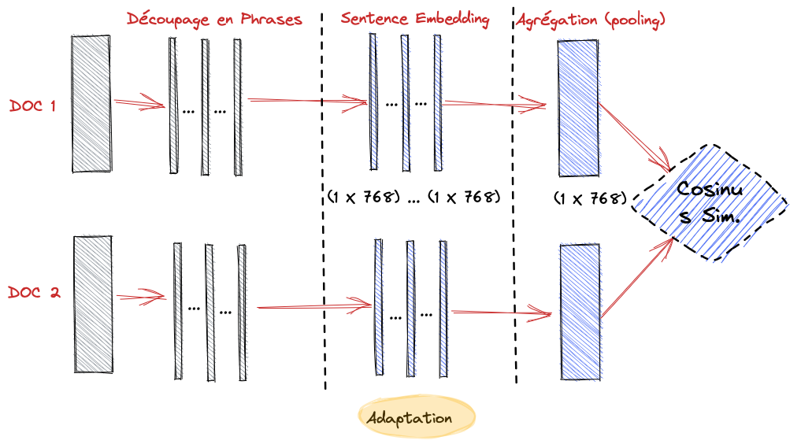

<!-- [TOC] -->

# How to run the project?

In the following, we suppose that the ``LabNbook`` database and the ``versionning`` (of the form `id_report.gzip`) files are available in your local machine. Note that, the project can be run without the `Prefect` orchestrator. It can be done by removing in all python flows (as `flow_0.py`) files the `Prefect` tags (`@task, @flow and @logger`) and ignoring steps 1 and 2 belows.

 View content 

1. Create a Prefect account following this [link](https://www.prefect.io/).
2. Configure Prefect cloud following this [link](https://docs.prefect.io/latest/ui/cloud-local-environment/).
3. Run the following command line in your terminal in order to clone this git repository:
  
        Git clone https://github.com/anismhaddouche/Indicators.git
4. Past the `versionning` folder into the `data` folder.

5. Create a virtual env with conda. If conda is not installed, follow this [link](https://conda.io/projects/conda/en/latest/user-guide/install/index.html) in order to install it.

        conda env create -f python_env.yml

6. Modifies these sections in the `pyproject.toml` file
   1. `database`: in order to connect to the database (which is assumed to be installed in your machine):

                user = "your_user"
                password = "your_password"
                host = "localhost"
                database_name  = "your_database_name"

   2. `missions`: choose if you want to run the project on all missions or only a subset.

                all = false # Choose all missions in the versioning folder
                subset =  ["1376","453","1559","1694","556","534","1640","1694","451","1237","533","647"]

7. In order tu run the all the flows locally without `Prefect`, open a terminal, navigate to the repository `Indicators` and run the following commands:

        conda activate ml 
        python scripts/run_flows.py

8. In order tu run all flows from `Prefect` (cloud) in your browser in order to monitor the flows or run it locally with
   1. Write this commands in your terminal 
        prefect server start
        prefect deployment build scripts/run_flows.py:run_flows -n "labnbook" &&
        prefect deployment apply run_flows-deployment.yaml &&
        prefect agent start -q default  
   2. Open `Prefect UI` (cloud or local) and click into `RUN` in the `Deployment` menu
   3. You can skip 1, 2 and simply write in your terminal

          python scripts/run_flows.py

9. In order to get some reports run this command:

        streamlit run scripts/dashboard.py

# Flows description

We describe here python scripts (flows) in the [scripts](scripts) folder. 

 View content 

## [flow_0.py](scripts/flow_0.py)

The purpose of this flow is to connect to the previously installed `LabNbook` database and prepare `LabDocs` for the next flow which consists of calculating  contribution matrices.

### Tasks (Flow_0)

* `extract_text_init`

  * Dependencies
    * The dictionary `[database]`in the `project.toml`file.
  * Returns
    * The file `data/tmp/0_labdocs_texts_init.json.gz`

* `extract_text`

* Dependencies:
  * The dictionary `[regex_text_patterns]` in the `project.toml`file.
* Returns:
  * The folder `data/tmp/0_missions_texts`

## [flow_1.py](scripts/flow_1.py) 

The purpose of this flow is to calculate contribution matrices and some variables that describes `LabDocs` as the number of tokens, segments, ... etc.

### Tasks (Flow_1)

* `contrib_and_segmentation`
  * Dependencies
    * The folder `data/tmp/0_missions_texts`
    * The nlp model the config section `["nlp"]["spacy_model"]` of the file `project.toml`
  * Returns
    * The folder `data/tmp/1_missions_contrib`

## [flow_2.py](scripts/flow_2.py) 

The purpose of this flow is to calculate all indicators.

### Tasks (Flow_2)

* `nonsemantic_indicator`
  * Dependencies
    * The dictionary `["missions"]` in `project.toml`file
  * Returns
    * The file `data/tmp/2_collab.json.gz`
  
* `semantic_indicators`
  * Dependencies
    * The two dictionary `["nlp"]["model"]` and `["missions"]` in the `project.toml` file
    * The nlp model in the config section `[config_nlp]` of the file `project.toml`
  * Returns
    * The file `data/tmp/reports/2_semantic.json`

## [flow_3.py](scripts/flow_3.py) 

The purpose of this flow is to generate some reports.

### Tasks (Flow_3)

* `summary_nonsemantic_indicators_csv`
  * Dependencies
    * The file `data/tmp/2_collab.json.gz`
  * Returns
    * The file `data/tmp/reports/3_summary_nonsemantic_indicators.csv` and its corresponding Pandas DataFrame `df_nonsemantic`
  
* `semantic_indicator_csv`
  * Dependencies
    * The file `data/tmp/reports/2_semantic.json`
  * Returns
    * The file `data/tmp/reports/3_summary_semantic_indicator.csv` and its corresponding Pandas DataFrame `df_semantic`
  
* `get_times`
  * Dependencies
    * The file Pandas DataFrames `df_nonsemantic` and `df_semantic`
  * Returns
    * The file `data/tmp/reports/3_times.csv`

<!-- markdownlint-disable MD033 -->

# How to improve this work?

Besides the improvements concerning the quality of the python code, I propose two major improvements paths. The first one concern the nlp model in `scripts/utils/fr_LabnbookNer-0.0.0` used in the task `contrib_and_segmentation` of [flow_1.py](scripts/flow_1.py) . The second one is the model `all-MiniLM-L6-v2` used in the task `semantic_indicator` of the [flow_2.py](scripts/flow_2.py). We give below some suggestions in order to improve these two models.

 View content 

## Improve the `all-MiniLM-L6-v2` nlp model

### What this model does?

As mentioned before, this model is used in the task `semantic_indicator` of the [flow_2.py](scripts/flow_2.py). More precisely, let's suppose that we have a Labdoc that evolves from a version $v_1$ to a version $v_2$ where these versions may be written by the same author of two different authors. This model takes these two versions as input and gives a score in $[0,1]$ as output. The value $0$ means that the semantic contents of $v_1$ and $v_2$ is completely different where $1$ means that it is the same semantic contents. Thus, this model is used two evaluate the semantic evolution of a LabDoc over its versions and results are saved in the file [data/tmp/2_semantic.json](data/tmp/2_semantic.json).

It is worth to notice that this model is used sequentially between two Labdoc versions. For instance, given `V1`, `V2` and `V3`, results is of the form

* $similarity(v_1,v_1) = s_1 =1$
* $similarity(v_1,v_2) = s_2$
* $similarity(v_2,v_3) = s_3$

where, for $i=1,2,3$ the scores $s_i$ $\in [0,1]$.

As a concrete example, here is the output for the Labdoc `340270` which is a dictionary of the form `{"id_labdoc:{id_trace}:["id_user",score]}` saved in the file [data/tmp/2_semantic.json](data/tmp/2_semantic.json).

    "340270": {"5866822": ["10893", 1], "5869856": ["10917", 0.57]}, "340978": {"5885737": ["10893", 1]}

Note that, the first score is always equals $1$ since it is computed with the same version ($similarity(v_1,v_1) = s_1 =1$) which is only useful for code purposes.

### How it works?

To compare the similarity between two versions of the same LabDoc, the process is done in two steps (See Figure 1).

* The first step involves computing a vector of numbers in $R^p$ (a tensor) for each version, denoted as $v_1$ and $v_2$, respectively. This is known as the **embedding** step in natural language processing (NLP).
* Then, we calculate the cosine similarity between these two vectors using the formula $similarity(v_1, v_2)$. You can refer to the Python script [flow_2.py](scripts/flow_2.py) from line 104 to line 123 to understand how this calculation is performed.
  
  

### How to improve this model ?

The objective is to improve the semantic interpretation, of Labdocs, of the used NLP model `all-MiniLM-L6-v2` by improving its **embedding**. Note that, in this project I used this model for its implementation simplicity in order to have a first draft. It is not well adapted to our dataset since we have a lot of mathematical formulas. For future works, I suggest to use a well adapted model like [MathBert](https://huggingface.co/tbs17/MathBERT) since it is trained on scientific texts containing mathematical formulas.

In order to improve the **embedding** of our NLP model we have to train (fine-tune) our pre-trained model to do a *task* using our set of LabDocs. A well adapted task here is the Masker Language Modeling (MLM). It is an unsupervised learning technique that involves masking tokens in a text sequence and training a model to predict the missing tokens. This creates an improved **embedding** that better captures the semantics of the text (see this [turorial](https://towardsdatascience.com/masked-language-modelling-with-bert-7d49793e5d2c)).
<!-- If we want to improve the **embedding** we first chose a model like [MathBert](https://huggingface.co/tbs17/MathBERT) -->

<!-- markdownlint-enable MD033 -->

