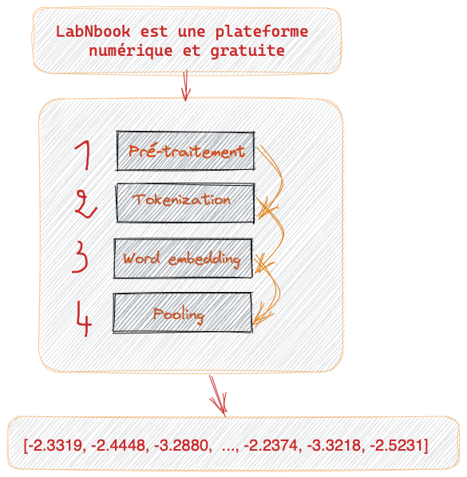

#  Comment mesurer la similarité sémantique entre deux documents texte ?

---

## Principe

* L’idée générale est de représenter chaque document dans un vecteur dans $R^p$
* Ensuite, pour comparer la similarité textuelle de ces deux documents, il suffit de comparer leurs deux vecteurs respectifs avec la <r>distance cosinus</r>
  
    

        
    

---

## Principe

* On peut le faire en 4 étapes
    

        
    

---

## Principe

* L’étape 2 est la plus importante
* En jargon NLP on appelle cette étape <r>sentence embedding</r>
* C'est une problématique d'actualité en NLP

---

## Sentence embedding

* L'application de la sentence embedding à une phrase donne représentation sémantique de celle-ci
* Les modèles de type <r>`Transformers`</r> ont une architecture qui peut être utilisée pour faire le  <r>sentence embedding</r>
* Voici comment on peut le faire en 4 étapes

    

        
    

---

## Sentence embedding

1. **Prétraitement** : Mettre en minuscules, supprimer la ponctuation et les caractères spéciaux, ainsi que les mots de remplissage tels que "le", "la", "de", etc.

2. **Tokenization** : Convertir nos phrases en une séquence de <r>tokens</r> en utilisant un tokenizer spécifique.
   * Un tokenizer est un outil qui permet de découper une phrase en mots et de les transformer en nombres que le réseau de neurones peut comprendre.

    

        
    

---

## Sentence embedding

3. **Word** **Embedding** : Alimenter notre séquence de tokens dans un modèle de type Transformer pré-entraîné, tel que BERT.
   * Ce modèle a déjà été entraîné sur une grande quantité de données textuelles et est capable de comprendre <r>le sens des mots</r>
   * Le modèle va alors passer la séquence de tokens à travers plusieurs couches de calculs et produire un vecteur de sortie pour chaque token.
   * Ce que nous voulons, c'est un seul vecteur qui représente l'ensemble de la phrase

4. **Pooling :** Consiste à prendre la moyenne ou la somme des vecteurs de sortie de toutes les couches de calculs du modèle de transformer. Cette opération nous donne un seul vecteur qui représente la phrase entière.

---

## Processus complet

    

---

## Notes

* Dans nos LD textes, que représentent les tokens ?
  * Par définition, un token est une unité de sens. Dans notre cas ça peut etre des formules, mots ou tableau
  * Il faut utiliser un modèle adapté aux textes contenant des formules pour une tokenization efficace, entre autres, qui est capable de détecter les formules
  * Le meilleur candidat pour l’instant c’est [Flaubert](https://huggingface.co/flaubert/flaubert_base_uncased)
  <!-- * Il faut aussi l’entraîner sur notre dataset pour une meilleur tokenization -->

---

## Notes

* Èvaluer/Améliorer le sentence embedding
  * Entrainer Flaubert (qui est déjà pré-entrainé sur des textes scientifiques) sur note dataset LabNbook à une tache de MLM  (Masker Language Modeling)
* On calcule la similarité à chaque changement d'auteur sur toutes les versions du LD
* Comment exploiter cette approche pour décrire la collaboration ?
* Pour expérimenter, il faut `impérativement` sélectionner un ensemble de LD ayant :
  * Suffisamment de texte
  * Pas beaucoup de formules ni de tableaux

---

## Exemple

    

---

## Suite du travail

* Sélectionner un ensemble de LD pour évaluer notre nouvel indicateur et l'implémenter
* Faire une évaluation de cet indicateur avec les deux entre
* Unifier et documenter les deux projets : extraction de formule et indicateurs sémantique

---
